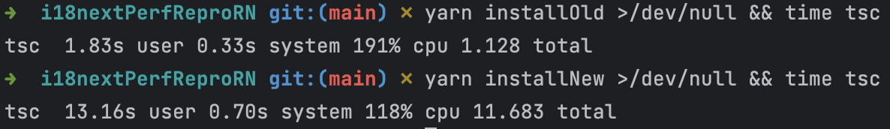

# Perf regression reproduction

the i18n folder contains all relevant code.

1. run `yarn install` (you don't need to any react-native tooling, just yarn is fine)
1. run `yarn installOld >/dev/null && time tsc`
2. run `yarn installNew >/dev/null && time tsc`

see package.json what the scripts are doing

Result on my machine:

